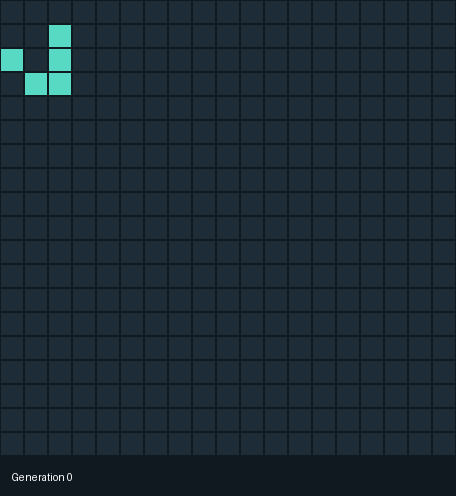

# Jeu de la vie de Conway

**Conception et programmation orientée objet · CESI · Deuxième année**

## Objectif

Transformer les règles du Jeu de la vie en une application capable de simuler l’évolution d’une population de cellules et de la représenter à l’écran.

## Réalisation

Conception d’une application en C++ avec deux modes d’affichage : console et interface graphique avec SFML. La simulation charge une grille, applique les règles d’évolution et enregistre les générations. L’interface permet de mettre en pause, d’avancer pas à pas et de revenir à l’état initial.

## Résultat présenté

Une simulation organisée autour de composants distincts : cellules, états, règles, grille et affichage. L’animation ci-dessous permet de voir l’évolution de la grille à partir des 66 générations exportées avec le projet.

*Animation réalisée à partir des données exportées du projet ; elle ne constitue pas une capture de l’interface graphique.*

## Compétences acquises

- Traduire des règles en algorithmes et structurer une application.
- Concevoir des classes et utiliser l’héritage et le polymorphisme.
- Séparer la logique de simulation de l’affichage.
- Lire et écrire des fichiers pour charger et conserver les résultats.
- Modéliser avec UML et organiser le travail avec Git.

**Outils :** C++, SFML, UML, Visual Studio et Git.

[Retour au profil et au CV](https://github.com/ilyes800)
